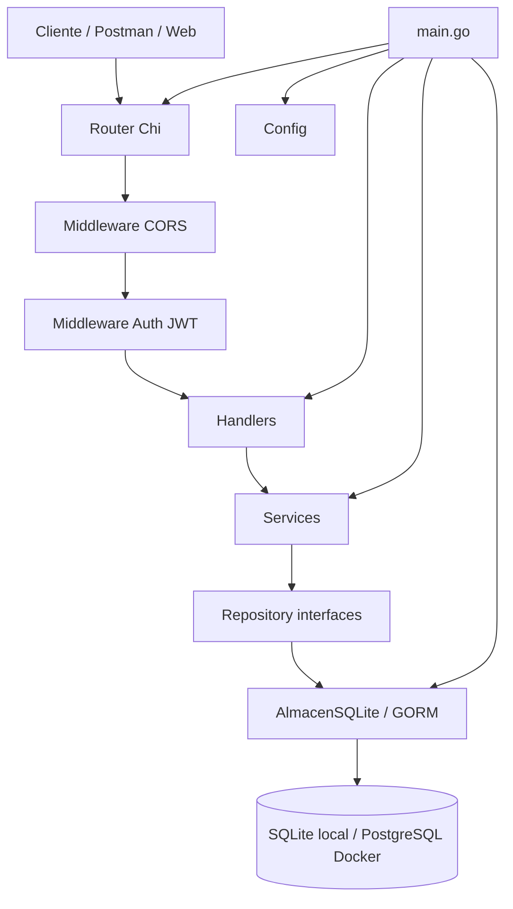
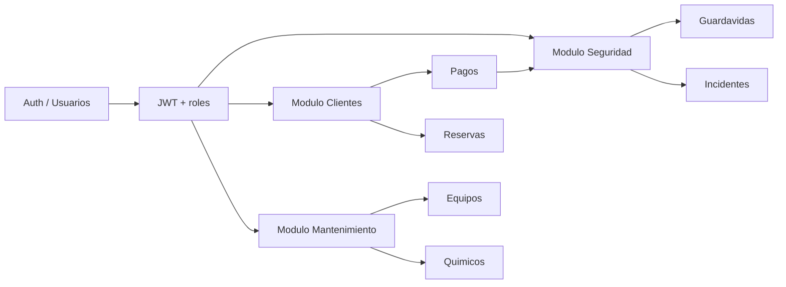

# Diagrama de arquitectura

La API de Piscina Comunitaria Los Ceibos usa una arquitectura en capas para separar transporte HTTP, reglas de negocio y persistencia.

## Flujo de una request

1. El cliente envía una petición HTTP a una ruta `/api/v1/*`.
2. `chi` resuelve la ruta y aplica middlewares globales como CORS y logging.
3. Las rutas protegidas pasan por `middleware.Auth`, que valida el JWT y agrega datos del usuario al contexto.
4. El `handler` decodifica el JSON, lee parámetros de ruta y devuelve la respuesta HTTP.
5. El `service` aplica reglas de negocio y validaciones antes de guardar o consultar datos.
6. El `repository` define las operaciones necesarias para persistencia.
7. `AlmacenSQLite` implementa esas interfaces usando GORM.
8. GORM ejecuta las consultas sobre SQLite en local o PostgreSQL con Docker Compose.

## Capas principales

| Capa | Ubicacion | Responsabilidad |
| --- | --- | --- |
| Entrada | `cmd/piscina-api/main.go` | Carga configuracion, abre DB, migra modelos, crea services, handlers y router. |
| Router HTTP | `cmd/piscina-api/main.go` | Define rutas con `chi` y agrupa endpoints por modulo. |
| Middleware | `internal/middleware` | CORS, autenticacion JWT y control por roles. |
| Handlers | `internal/handlers` | Adaptan HTTP a llamadas del service: JSON, status codes y parametros. |
| Services | `internal/service` | Contienen reglas de negocio y validaciones. |
| Repository | `internal/storage/almacen.go` | Interfaces usadas por services para desacoplar persistencia. |
| Persistencia | `internal/storage/sqlite.go` | Implementacion GORM para SQLite/PostgreSQL. |
| Dominio | `internal/models` | Structs con tags JSON/GORM y entidades del sistema. |

## Integracion entre modulos

- Seguridad consulta clientes y pagos para decidir si un acceso o incidente es valido.
- Auth protege las rutas y permite restringir usuarios administrativos por rol.
- Mantenimiento administra equipos, registros y quimicos asociados a la operacion de la piscina.
